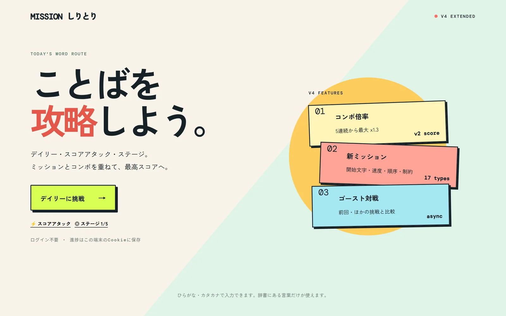

# ミッションしりとり

**19万語の辞書とサーバー側ルール判定で動く、60秒のしりとりゲームです。ログイン不要。**

[](https://mission-shiritori.vercel.app)
[](https://shin7303.github.io)



> **Vibe Coding で開発しました。** MVP仕様（v3）と拡張仕様（v4）を人間が先に文書化し、
> 実装は **Claude Code** と **Codex** が担当しています。仕様書はリポジトリ内の
> [v3](mission-shiritori-spec-v3-mvp.md) / [v4](mission-shiritori-spec-v4-extensions.md) にあります。

Next.js / TypeScript で実装した、ミッション制のしりとりゲームです。日本語正規化、サーバー側のルール判定、日替わりチャレンジ、リプレイ、テストを一つの小規模アプリとしてまとめています。

## この実装の見どころ

| 観点 | やったこと |
| --- | --- |
| 日本語処理 | NFKC・カタカナ→ひらがな・小書き文字・長音を正規化し、SudachiDict-fullから抽出した19万語規模の名詞コーパスと照合 |
| サーバー権威の設計 | 接続・重複・「ん」終了・時間切れの判定とスコア計算をすべてAPI側に置き、クライアントからの加点を成立させない |
| 冪等性 | `clientMoveId`により、通信リトライで同じ手が二重加点されない |
| データ駆動 | 17種のミッション（開始文字・速度・順序・制約）を定義データで表現。ロジックを変えずに追加できる |
| ログインなしの状態管理 | HMAC署名付きHttpOnly CookieにゲストIDとステージ解放進捗を保存 |
| 再現性 | HMACシードで全プレイヤー共通のデイリーミッションを生成（Asia/Tokyo基準） |
| ロジックの分離 | ゲームルールを`lib/game`に隔離し、Route HandlerとUIは呼び出しのみ。Vitestで正規化・辞書・ミッション・進行を検証 |
| AIの使い方 | 辞書の語彙分類にAIをオフラインで使い、結果をJSONに固定。ゲーム実行時にAI APIは呼ばず、生成AIの不安定さをランタイムに持ち込まない |

## 起動

```bash
npm install
npm run dev
```

`http://localhost:3000` を開きます。テストと本番ビルドはそれぞれ `npm test`、`npm run build` です。

## 本番環境の設定

`.env.example` を参考に、ホスティング先の環境変数へ次を設定します。値は十分に長いランダム文字列を使い、リポジトリへコミットしません。

- `COOKIE_SIGNING_SECRET` — ゲストCookieの署名に必須。本番で未設定の場合は起動時にエラーになります。
- `DAILY_SEED_SECRET` — 日替わりミッションの選択を安定させるための秘密値。

Vercelで公開する場合は、Production環境に両方を登録してからデプロイします。

## v4で追加した機能

- デイリー、何度でも挑戦できるスコアアタック、5段階のステージモード
- 連続成功で最大 x1.3 になるコンボ倍率（`scoring_version: 2`）
- 開始文字・速度・順序・制約を含む17種のデータ駆動ミッション
- 1プレイ1回の取り消し。スコア・コンボ・ミッション進捗を手番ログから再計算
- 時間延長、次手倍率、ミス無効、ヒント回復のミッション報酬
- 前回または別プレイとのゴースト比較、公開ランキングのリプレイAPI
- デイリー結果の順位、平均・中央値、ミッション達成率、最長連鎖
- ログインの代わりに、署名付き・HttpOnly CookieへゲストIDとステージ解放進捗を保存

## 実装したMVP

- カタカナ→ひらがな・NFKC・小書き文字を扱う日本語正規化
- 国名・都道府県・主要地名に加え、SudachiDict-full から抽出した19万語規模の名詞コーパスによる辞書照合
- 接続、重複、「ん」終了、時間切れのサーバー判定
- 文字数・カテゴリ・末尾文字・単語数の4種のデータ駆動ミッション
- ミッション達成・同時達成・終了ボーナスのサーバー側スコア計算
- HMACシードによる日替わりで共通のミッション選択（Asia/Tokyo）
- 再送で二重加点しない `clientMoveId`、ヒント、結果表示、ランキングAPI

## API

- `POST /api/v1/game-sessions`
- `POST /api/v1/game-sessions/:id/moves`
- `POST /api/v1/game-sessions/:id/finish`
- `POST /api/v1/game-sessions/:id/hint`
- `POST /api/v1/game-sessions/:id/undo`
- `GET /api/v1/game-sessions/:id/replay`
- `GET /api/v1/rankings/daily`
- `GET /api/v1/profile`

## 設計メモ

ゲームルールは `lib/game` に分離し、Route HandlerとUIはその呼び出しだけを担当します。アカウント認証は実装せず、ゲストIDとステージ進捗だけを署名付き・HttpOnly Cookieに保存します。Cookieが削除・失効した端末ではステージ進捗もリセットされます。

公開デモでは、ゲーム中セッション・ゴースト・ランキングを単一のAPI関数内のメモリに保持します。そのため、サーバーの再起動やスケールアウト時にはプレイ履歴・ランキングが消去されます。

公開運用では `words`、`missions`、`game_sessions`、`game_moves`、`daily_challenges` をNeon PostgreSQLに移し、セッション作成・着手・終了をトランザクションにします。辞書を1万〜3万語へ入れ替えても、正規化・ミッション・スコアのドメインロジックは変更しません。MVPの構成は、Next.js Route HandlersとPostgreSQLを一体で運用し、実測上必要になるまでRedisや別APIサーバーを増やさない方針です。

`DAILY_SEED_SECRET` を環境変数に設定すると、本番用のデイリーシードに切り替わります。

## 開発・公開上の注意

- CIではテスト、Lint、本番ビルドを実行します。
- 本リポジトリにはライセンスを付与していません。コードの再利用・再配布は許可されません。
- SudachiDict由来の辞書データには別途条件があります。詳細は `THIRD_PARTY_NOTICES.md` を参照してください。

## 辞書データ

日常語は SudachiDict-full（`small_lex` / `core_lex` / `notcore_lex`）の原データから、普通名詞と、収録が絞り込まれた `small_lex` の地名・固有名詞、および国名だけを自動抽出しています。読みを持つ品詞付きコーパスを採用することで、生成AIによる不自然な語や読み誤りを避けています。原データは[配布サイト](http://sudachi.s3-website-ap-northeast-1.amazonaws.com/sudachidict-raw/)から取得し、展開先を `SUDACHI_SOURCE_DIR` に渡して `node scripts/build-sudachi-dictionary.mjs` を実行します。ライセンス表記は `THIRD_PARTY_NOTICES.md` にあります。

カテゴリは、既存の人手登録に加え、Gemini 3.6 Flash によるオフライン分類結果を `lib/game/data/sudachi-categories.json` へ保存します。ジャンルは動物・食べ物・植物・道具・場所・体・乗り物・衣類・スポーツ・音楽・自然・職業・建物の13種です。ゲーム実行時にAI APIは呼びません。追加分類は `node scripts/classify-sudachi-with-agy.mjs --limit=200` で小分けに実行でき、曖昧語は未分類のまま残す方針です。ゲームに載せるべきでないと判定された語は `lib/game/data/sudachi-blocked.json` に記録し、辞書から除外します。
